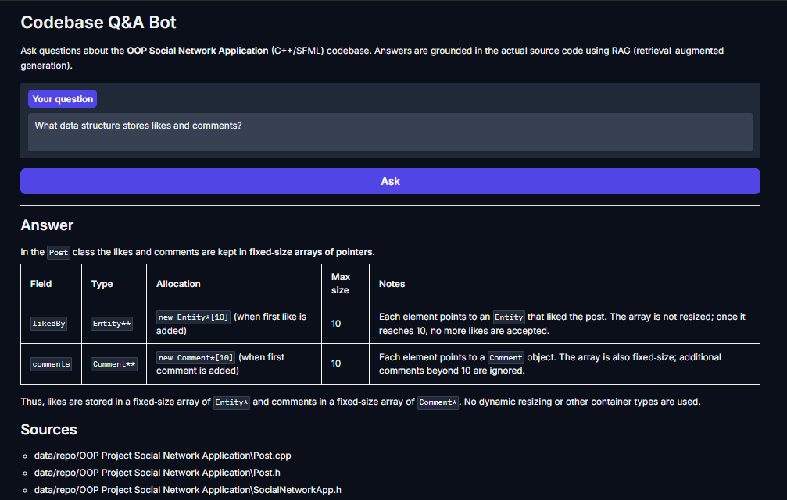

# Codebase Q&A Bot

A RAG-based assistant that answers natural-language questions about a C++/SFML codebase, grounding every answer in the actual source code instead of guessing.

## Demo

## Why this project
Understanding an unfamiliar codebase usually means manually going through files. This bot lets you just ask questions and get an answer sourced directly from the relevant functions, with citations.

## Tech stack
- **Orchestration**: LangChain (LCEL) + langchain-classic (ParentDocumentRetriever)
- **Vector store**: ChromaDB
- **Embeddings**: HuggingFace sentence-transformers (all-MiniLM-L6-v2)
- **Reranking**: cross-encoder (ms-marco-MiniLM-L-6-v2)
- **LLM**: Groq (openai/gpt-oss-20b)
- **UI**: Gradio

## Architecture
1. Source files are loaded and split into small "child" chunks (for precise search matching) and larger "parent" chunks (returned as full context).
2. A query retrieves the most similar child chunks, then a cross-encoder reranks candidates for relevance before their parent chunks are sent to the LLM.
3. The LLM answers strictly from the provided context, explicitly avoiding inference of behavior not shown in the code.

See results.md for detailed accuracy testing and debugging notes.

## Setup
1. Clone this repo
2. Create and activate a virtual environment:
python -m venv venv
venv\Scripts\activate
3. Install dependencies:
pip install -r requirements.txt
4. Create a `.env` file with your free Groq API key:
GROQ_API_KEY=your_key_here
5. Clone the target codebase into `data/repo`:GIT 
Tested with "https://github.com/fateehabasit/OOP-Social-Network-Application"
6. Run:
python app.py
7. Open the local URL shown in the terminal

## Known limitations
- Answers depend entirely on retrieval quality — the LLM will not fabricate functions that don't exist, but very obscure questions may still miss context.
- Free-tier LLM rate limits (Groq) can occasionally throttle large context requests.

## What I'd improve with more time
- Persistent, versioned vector store with a real record-keeping layer (e.g.LangChain's Indexing API) instead of in-memory rebuild on every run
- Automated evaluation suite instead of manual question checking